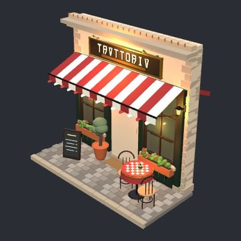
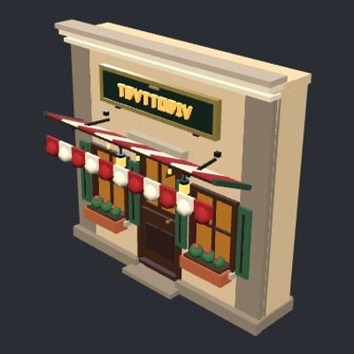

# 3JSBench

3JSBench evaluates LLMs on procedural text-to-3D generation of [Three.js](https://github.com/mrdoob/three.js) objects.

> a cozy italian restaurant storefront with the restaurant's name on the sign above the door, warm lit letters over a striped awning

| | GPT-6 Astra | Gemini 3.8 Flash | Grok 4.6 |
| :--- | :---: | :---: | :---: |
| |  |  |  |
| Restaurant name is readable | ✓ | ✗ | ✗ |
| Awning is level or slopes down outward | ✓ | ✓ | ✗ |
| Awning is connected | ✓ | ✗ | ✗ |
| Sign touches the building facade | ✓ | ✓ | ✓ |
| Awning and sign don't intersect | ✓ | ✓ | ✓ |
| No flickering surfaces | ✓ | ✗ | ✗ |
| **Result** | **Pass** (16/16) | **Fail** (11/16) | **Fail** (12/16) |

`tasks/<name>/prompt.md` holds the brief for each of the 100 tasks. The grader
source is coming soon.

Website: [3jsbench.com](https://3jsbench.com)
